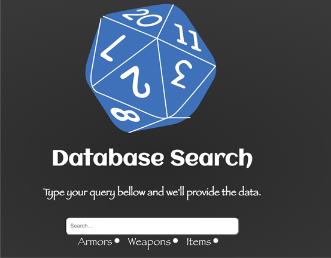

  

# Pathfinder API
DISCLAIMER:
This is built as proof of conscept for Educational purpose.
All data inside the API as in Names, and values, are all borrowed
from Pathfinder &copy; Wizard of the Coast.

## What is this?
After my friends introduced me to the beautiful world of tabletop roleplying games
back in 2011, found it could use some modernized update and begun working on building
a database to store Weapons, Armor and Item stas (somethingt that used to require us
to browse through a heavy book in the past).
As part of a Hand-in assignment for YRGO, we got tasked with designing a React application
that would fetch and display data via an API, so I desided to tie the two together.

## What does it support?
* search for all results of item / weapon / armor by selecting it's radio button and press search
* partial keywords through the use of `LIKE` statements. (for instance 'bow' would list bow Longbows and normal bows)

## The process
To start off, I needed to first make sure I could set up an API to load the data
from my database. This seemed like a trivial task at first, but lead to a nightmare
of debugging with CORS restrictions that took many more hours than anticipated.

Once the API got done, it was a simple task of fetching the data and list it in components to
render a nice listing.
The original idea was to have the data presented in a search results list as Scrolls
(to keep the immersion going) utulising the `
` element. That way I could make it
so that when you clicked on it, the scroll would roll out with the data you for the highligted item.
